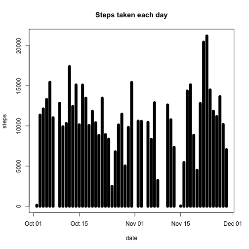
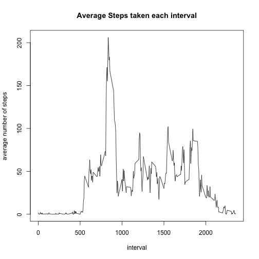
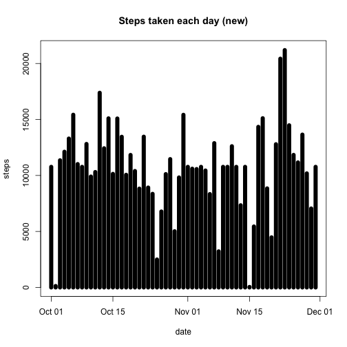

##Loading and preprocessing the data

```r
library(lattice)
activity<-read.csv("~/Desktop/Coursera/ReproducibleResearch/Week2/activity.csv")
head(activity)
```

```
##   steps       date interval
## 1    NA 2012-10-01        0
## 2    NA 2012-10-01        5
## 3    NA 2012-10-01       10
## 4    NA 2012-10-01       15
## 5    NA 2012-10-01       20
## 6    NA 2012-10-01       25
```
##What is mean total number of steps taken per day?  
The total number of steps taken for each day:

```r
total_step_per_day<-aggregate(activity$steps~activity$date,FUN=sum,na.rm=T)
names(total_step_per_day)<-c("Date","Steps")
total_step_per_day$Date<-as.Date(total_step_per_day$Date)
head(total_step_per_day)
```

```
##         Date Steps
## 1 2012-10-02   126
## 2 2012-10-03 11352
## 3 2012-10-04 12116
## 4 2012-10-05 13294
## 5 2012-10-06 15420
## 6 2012-10-07 11015
```
The histogram of the total number of steps taken each day:

```r
plot(total_step_per_day$Date,total_step_per_day$Steps,type="h",main="Steps taken each day",xlab="date",ylab="steps",lwd=8)
```

 
.  
The mean and median of the total number of steps taken per day:

```r
mean<-mean(total_step_per_day$Steps,na.rm=T)
mean
```

```
## [1] 10766.19
```

```r
median<-median(total_step_per_day$Steps,na.rm=T)
median
```

```
## [1] 10765
```
##What is the average daily activity pattern?
The time series plot of the 5-minute interval (x-axis) and the average number of steps taken, averaged across all days (y-axis):

```r
avg_step_interval<-aggregate(activity$steps~activity$interval,FUN=base::mean,na.rm=T)
names(avg_step_interval)<-c("Interval","Steps")
plot(avg_step_interval$Interval,avg_step_interval$Steps,type="l",main="Average Steps taken each interval",xlab="interval", ylab="average number of steps")
```

 

```r
which(grepl(max(avg_step_interval$Steps), avg_step_interval$Steps)) ## look for the row that contains the largest number of steps (column 104)
```

```
## [1] 104
```

```r
avg_step_interval[104,]
```

```
##     Interval    Steps
## 104      835 206.1698
```
The interval 835, on average across all the days in the dataset, contains the maximum number of steps.

##Imputing missing values

```r
mv<-sum(is.na(activity))
mv
```

```
## [1] 2304
```
The total number of missing values in the dataset is 2304.  
The following is to fill the missing value in the original data with the mean for that 5-minute interval:

```r
avg_step_int<-aggregate(steps~interval,data=activity,FUN=base::mean)
fill<-numeric()
for (i in 1:nrow(activity)){
        row<-activity[i,]
        if (is.na(row$steps)) {
                steps<-subset(avg_step_int,interval==row$interval)$steps
        } else {
                steps<-row$steps
        }
        fill<-c(fill,steps)
}
```
A new dataset that is equal to the original dataset but with the missing data filled in:

```r
activity_new<-activity
activity_new$steps<-fill
head(activity_new)
```

```
##       steps       date interval
## 1 1.7169811 2012-10-01        0
## 2 0.3396226 2012-10-01        5
## 3 0.1320755 2012-10-01       10
## 4 0.1509434 2012-10-01       15
## 5 0.0754717 2012-10-01       20
## 6 2.0943396 2012-10-01       25
```
Histogram of the total number of steps taken each day:

```r
total_step_per_day_new<-aggregate(activity_new$steps~activity_new$date,FUN=sum,na.rm=T)
names(total_step_per_day_new)<-c("Date","Steps")
total_step_per_day_new$Date<-as.Date(total_step_per_day_new$Date)
plot(total_step_per_day_new,type="h",lwd=8,main="Steps taken each day (new)",xlab="date",ylab="steps")
```

 
.  
The mean and median total number of steps taken per day:

```r
mean_new<-mean(total_step_per_day_new$Steps,na.rm=T)
mean_new ## the previous mean is 10766.19
```

```
## [1] 10766.19
```

```r
median_new<-median(total_step_per_day_new$Steps,na.rm=T)
median_new ## the previous median is 10765
```

```
## [1] 10766.19
```
The mean remains the same compared to the previous estimated mean value. The median slightly differs from the previous estimated median value. The histograms do not differ.

##Are there differences in activity patterns between weekdays and weekends?
Creating a new factor variable with two levels – “weekday” and “weekend”, the variable name "day":

```r
activity_new$date<-as.Date(activity_new$date)
weekdayy<-sapply(activity_new[,2],weekdays)
day<-vector()
for (i in 1:nrow(activity_new)){
        if (weekdayy[i] == "Sunday" | weekdayy[i] == "Saturday") {
                day[i] = "weekend"
        } else {
                day[i] = "weekday"
        }
}
activity_new<-cbind(activity_new,day=day)
head(activity_new)
```

```
##       steps       date interval     day
## 1 1.7169811 2012-10-01        0 weekday
## 2 0.3396226 2012-10-01        5 weekday
## 3 0.1320755 2012-10-01       10 weekday
## 4 0.1509434 2012-10-01       15 weekday
## 5 0.0754717 2012-10-01       20 weekday
## 6 2.0943396 2012-10-01       25 weekday
```
The panel plot containing a time series plot of the 5-minute interval (x-axis) and the average number of steps taken, averaged across all weekday days or weekend days (y-axis):

```r
avg_step_day<-aggregate(activity_new$steps~activity_new$day+activity_new$interval,FUN=base::mean)
names(avg_step_day)<-c("Day","Interval","Steps")
xyplot(Steps~Interval|Day,avg_step_day,type="l",layout=c(1,2),ylab="Number of steps")
```

 
